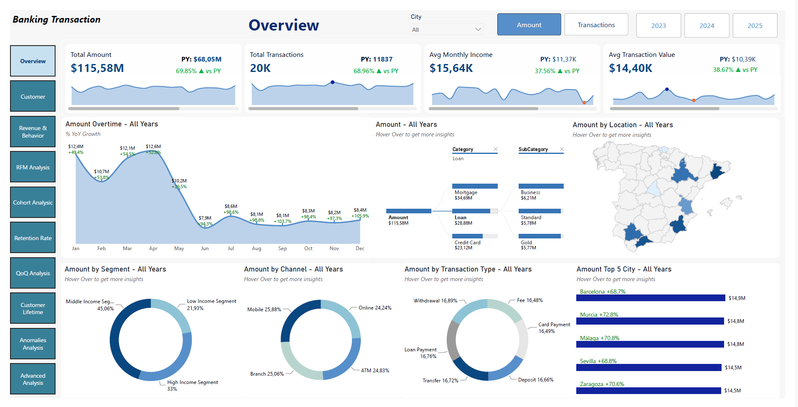
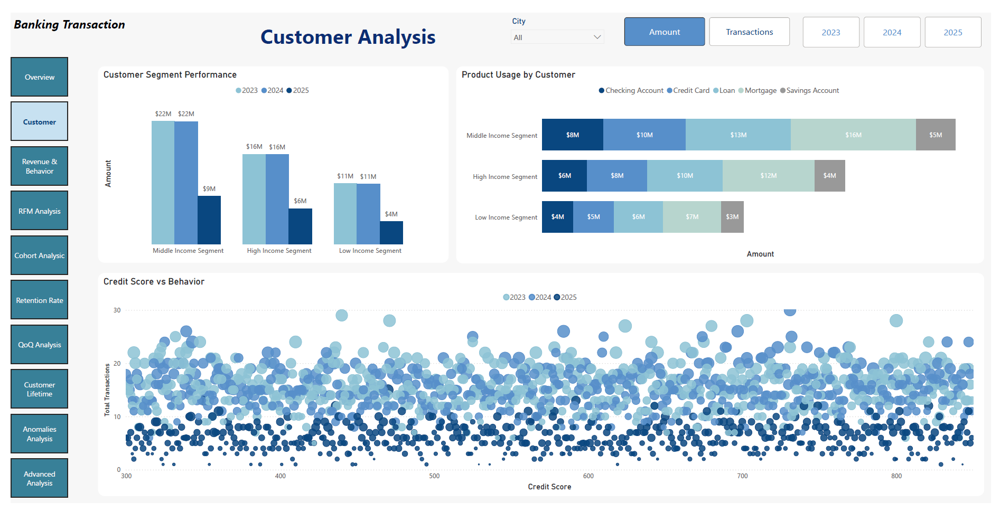
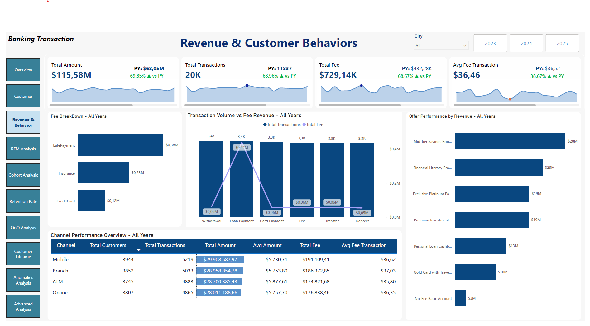
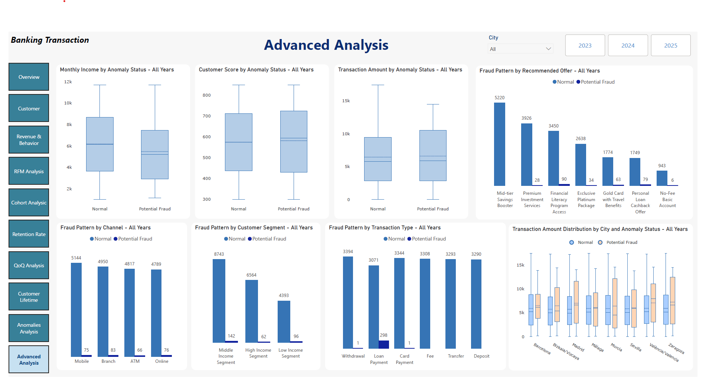
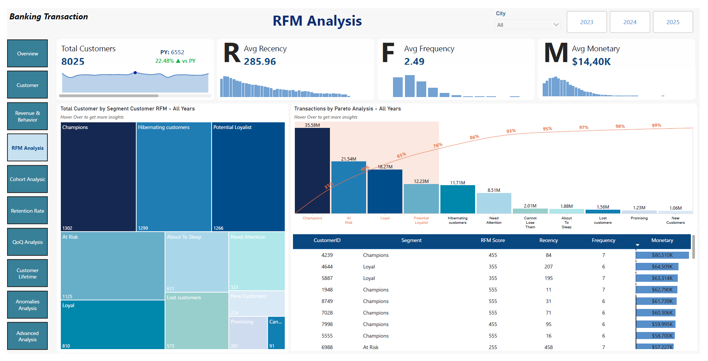
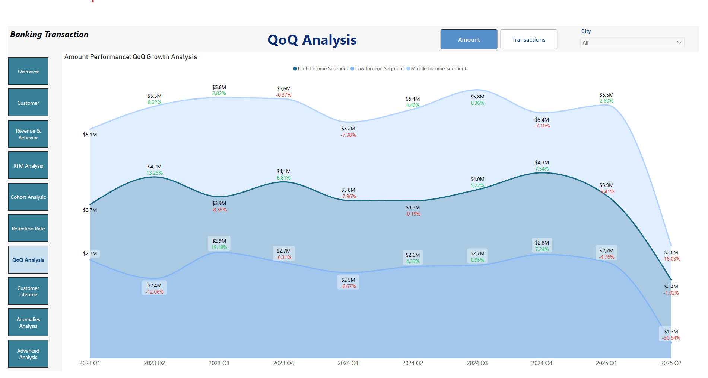
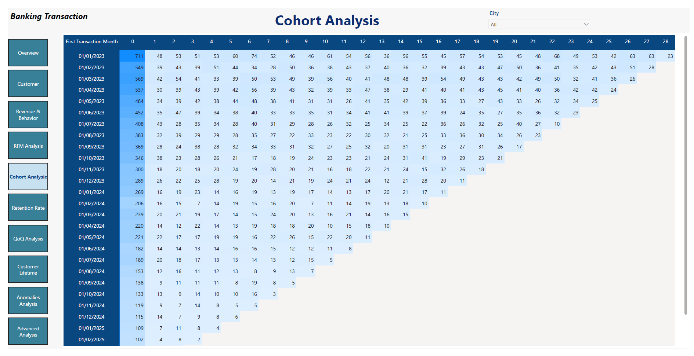
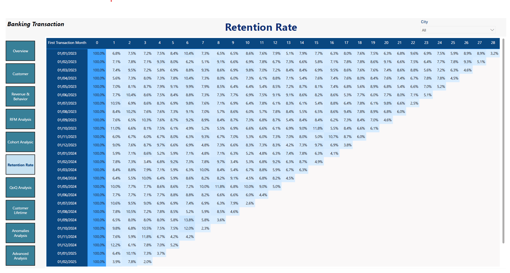
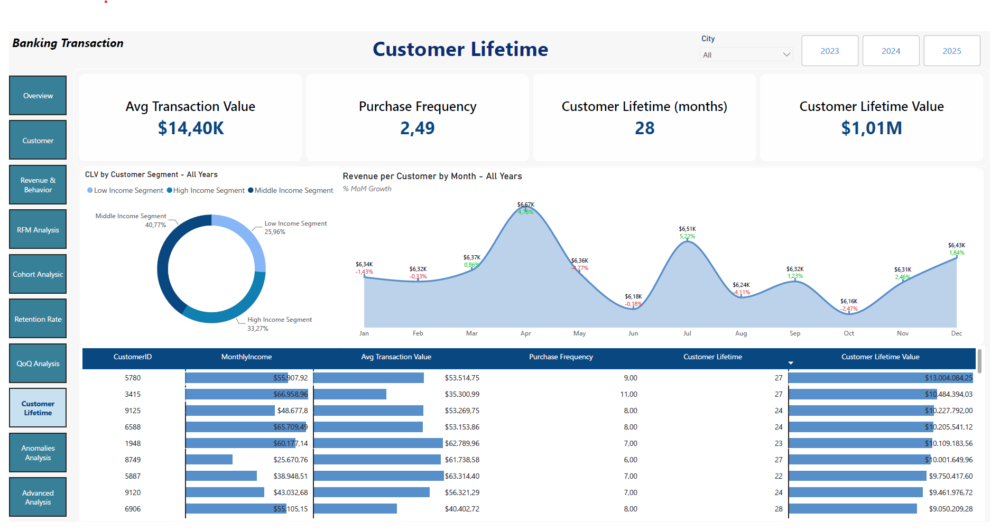
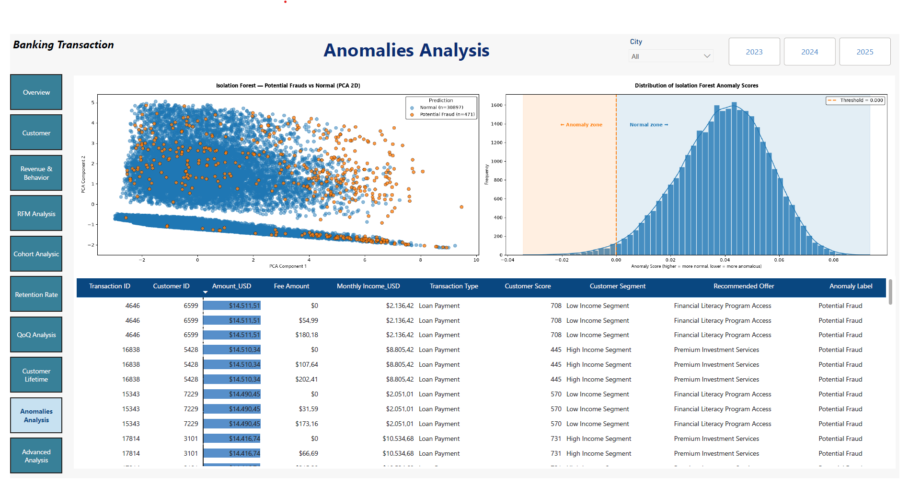

# 🏦 Banking Analytics Fraud Detection 🛡️

**Notebook:** `banking_transaction.ipynb`  
**Dashboard Export:** `Dashboard.pbix`  
**Author:** `Nguyễn Đăng Khôi`  
**Project Type:** Power BI + Python  

---

<p align="center">
  
  
  
  
  
  
</p>

---

## 🔍 Project Overview & Objectives

Fraud detection and customer lifetime value optimization are core challenges in the banking and financial sectors. This project tackles advanced customer behavioral analytics integrated with anomaly detection using transactional bank data based on two main pillars:
1. **Business Optimization:** Behavioral customer segmentation (RFM Analysis), customer lifetime value modeling (CLV), growth rate measurement (QoQ), and cohort retention analysis.
2. **Risk Management:** Deploying unsupervised machine learning algorithms to detect potential ror-risk behaviors and anomalous transactions without relying on predefined labels.

The entire analytical workflow is consolidated into an **Interactive Power BI Dashboard** designed for risk managers and business operators to drive data-backed strategic decisions.

---

## 💡 Key Insights & Recommendations

### 🔍 Fraud Insights

**Fraud Behavior Summary (Isolation Forest Results)**
* Fraudulent transactions exhibit **higher amounts and significantly higher fees**, indicating strong anomaly signals.
* Anomalies are **highly concentrated in Loan Payment transactions**, suggesting a **clear and isolated fraud pattern**.
* Higher fraud occurrence is observed in **Loan and Credit Card products**, indicating **strong product-specific risk concentration**.
* Fraud is **evenly distributed across channels and locations**, showing **no channel or geographic dependency**.
* Customers associated with anomalies have **slightly lower income**, but this remains a **weak signal**.
* Fraud appears across all segments, with slightly higher presence in **middle and low-income groups**.
* Fraud patterns are **highly distinct and extreme**, making them easier to detect using global anomaly detection methods.

**Fraud Behavior Summary (Local Outlier Factor Results)**
* Fraudulent transactions show **higher amounts and elevated fees**, but with more overlap compared to global models.
* Anomalies are **more broadly distributed across transaction types**, with a moderate peak in **Loan Payment**.
* Fraud is **evenly distributed across channels and locations**, indicating **no channel or geographic dependency**.
* Higher anomaly presence is observed in **Loan and Credit Card products**, suggesting **moderate product-related risk signals**.
* Customers associated with anomalies tend to have **lower income levels**, indicating **financial stress as a stronger signal**.
* Slightly higher occurrence in **low and middle-income segments**, with weaker signals in high-income groups.
* Fraud patterns are **more subtle and locally driven**, capturing **behavioral deviations rather than extreme outliers**.

### 🔄 Retention & Behavior Insights

**Cohort & Engagement Summary**
* **Cyclical Retention Patterns:** Cohort analysis reveals a slight but noticeable tendency for customers to return and transact either during the **first month** after their initial activity or on a **6-month cycle**. While not overwhelmingly dominant, reactivation rates see a measurable bump during these specific time windows.
* Applying the Pareto Principle (80/20 rule), a major portion of total revenue and fee income is contributed by VIP customer segments (`Champions` and `Loyal Customers`), requiring exclusive loyalty programs to retain high-value assets.

---

## 📌 Key Takeaways

* Fraud patterns are driven by a mix of **extreme anomalies** and **subtle behavioral deviations**.
* **Loan-related transactions and fee patterns** are the strongest fraud indicators.
* Fraud is **not dependent on geography or channel**.
* **Customer income and segmentation** provide additional risk signals.
* Different models capture **different dimensions of fraud behavior**.
* Customer retention exhibits **mild cyclicality**, with reactivation mildly peaking at the **1-month** and **6-month** marks.


---

## 🔄 End-to-End Pipeline
```text
1. Business Understanding    Define goals: Maximize Customer Value & Detect Fraud Risk
         ↓
2. Data Preprocessing        Data cleaning, missing value handling, normalization, Feature Engineering
         ↓
3. Behavioral Analytics      Implement RFM Segmentation, Cohort Matrix, QoQ Growth & CLV
         ↓
4. Anomaly Detection         Unsupervised ML Modeling: Isolation Forest & Local Outlier Factor
         ↓
5. Dimensionality Reduction  Apply PCA (2D Projection) to visualize anomaly separation boundaries
         ↓
6. BI Implementation         Develop a multi-tier governance interactive dashboard on Power BI
```
---

## 📊 Power BI Dashboard Architecture

The system features a comprehensive corporate-grade analytics architecture comprising **10 specialized dashboard pages** mapped directly from the pipeline infrastructure:

### 1. Financial & Business Campaign Overview
* Provides a high-level overview of key metrics: **total transaction amount, total transactions, average monthly income, and average transaction value**.
* Displays **monthly transaction trends**, highlighting fluctuations and year-over-year growth.
* Breaks down performance by **customer segments, transaction types, and channels** (Branch, ATM, Mobile, Online).
* Visualizes **geographic distribution of transactions** and identifies **top-performing cities**.
* Helps uncover **spending patterns, customer behavior, and potential anomalies across segments and locations**..
* *Dashboard Preview:*
<p align="center">
  
</p>

### 2. Customer Profile & Demographic Insights

* Provides an overview of **segment performance across years**, highlighting differences between middle, high, and low-income customer groups.
* Analyzes **product usage by customer segment**, showing how different segments interact with financial products (loans, credit cards, savings, etc.).
* Visualizes the relationship between **credit score and customer behavior**, helping identify patterns and potential risk signals.
* Enables comparison of **customer value distribution and engagement across segments**.
* Supports detection of **behavioral anomalies and segment-specific trends** for deeper analysis.
* *Dashboard Preview:*
<p align="center">
  
</p>

### 3. Revenue Metrics & Product Cross-Charging

* Provides a high-level overview of **total amount, total transactions, total fees, and average fee per transaction**.
* Breaks down **fee components** (late payment, insurance, credit card) to highlight main revenue drivers.
* Compares **transaction volume vs. fee revenue** across transaction types to evaluate efficiency and profitability.
* Analyzes **offer performance by revenue**, identifying top-performing financial products and campaigns.
* Evaluates **channel performance** (ATM, Branch, Mobile, Online) across customers, transactions, amount, and fees.
* Helps uncover **revenue patterns, fee structures, and optimization opportunities across channels and products**.
* *Dashboard Preview:*
<p align="center">
  
</p>

### 4. Advanced Core Behavioral Analytics
*The entry portal for deep-dive behavioral mining, establishing multi-variant interactions across consumer transaction history.*
* **Core Visuals:** Statistical summaries of frequency-recency paths, active tenure distributions, and primary product engagement grids.
* *Dashboard Preview:*
<p align="center">
  
</p>

### 5. RFM Behavioral Segmentation Grid

* Provides an overview of **customer base and RFM metrics**: Recency, Frequency, and Monetary value.
* Segments customers into groups such as **Champions, Loyal, At Risk, Potential Loyalists, and Hibernating**.
* Visualizes **customer distribution across segments**, helping identify high-value and at-risk groups.
* Applies **Pareto analysis (80/20 rule)** to highlight key segments contributing the most revenue.
* Analyzes detailed **RFM scores at customer level**, enabling deeper behavioral insights.
* Supports identification of **customer retention opportunities, re-engagement strategies, and revenue concentration risks**.

* *Dashboard Preview:*
<p align="center">
  
</p>

### 6. Quarter-over-Quarter (QoQ) Growth Tracking

* Visualizes **quarter-over-quarter (QoQ) growth in transaction amount** across customer segments.
* Compares performance between **high, middle, and low-income segments** over time.
* Highlights **growth trends and fluctuations**, including periods of acceleration and decline.
* Enables tracking of **segment-level contribution to overall revenue performance**.
* Helps identify **seasonality patterns, segment volatility, and potential downturn signals**.
* Supports analysis of **revenue dynamics and strategic focus across customer segments**.
* *Dashboard Preview:*
<p align="center">
  
</p>

### 7. Cohort Lifecycle Matrices

* Visualizes **customer retention by cohort**, tracking behavior after the first transaction month.
* Displays **retention rate over time**, highlighting how customer engagement declines across months.
* Provides both **percentage-based retention** and **absolute customer counts** for deeper analysis.
* Enables comparison across cohorts to identify **strong vs. weak retention periods**.
* Helps uncover **customer lifecycle patterns, churn behavior, and long-term engagement trends**.
* Supports identification of **retention improvement opportunities and early drop-off risks**.
* *Dashboard Preview:*
<p align="center">
  
</p>

### 8. Progressive Retention Rates
*Monitors the real-time survival curve of customer groups across varied product types over operational timelines.*
* **Core Visuals:** Line retention plots, product category drift metrics, and loyalty lifespan milestones.
* *Dashboard Preview:*
<p align="center">
  
</p>

### 9. Predictive Customer Lifetime Value (CLV) Modeling
*Maps the predicted long-term financial equity yield contributed per customer across financial lifespans.*
* **Core Visuals:** Value forecasting bins, high-value asset trajectory charts, and income-to-CLV elasticity.
* *Dashboard Preview:*
<p align="center">
  
</p>

### 10. AI-Powered Fraud & Anomaly Interception
*Risk assurance center visualizing unsupervised machine learning outputs for real-time security tracking.*
* **Core Visuals:** 2D PCA multi-dimensional anomaly projection, global outlier profiling (Isolation Forest), and local density drift tracking (LOF).
* *Dashboard Preview:*
<p align="center">
  
</p>

---

## 🛠️ Skills & Technologies Demonstrated

| Domain | Technical Implementation |
|---|---|
| **Data Engineering** | Processing large-scale relational data (20,000+ records), missing value imputation, transaction timestamp standardization, and data type alignment. |
| **Advanced Analytics** | Engineering behavior indicators: Recency, Frequency, Monetary metrics; modeling long-term CLV and creating progressive customer retention matrices (Cohort Matrix). |
| **Unsupervised ML** | Deploying Isolation Forest (global outlier detection) and Local Outlier Factor (localized density anomaly detection); applying PCA dimensionality reduction to visualize multi-dimensional data partitions. |
| **Business Intelligence** | Designing corporate-grade relational Power BI schemas, establishing robust star-schema data models, and optimizing advanced DAX expressions for complex time-intelligence metrics (Cohort, CLV, QoQ). |

---

## 📁 Project Structure

```text
banking-analytics-fraud-detection/
├── Code/
│   └── banking_transaction.ipynb    
├── Data/                           
│   ├── Banking_Transactional_Dataset.csv # Raw bank transaction dataset
│   ├── RankRFM.csv                      
│   └── isolation_output.csv              # Transaction records with anomaly flags appended by ML models
├── Images/                          
│   ├── Overview.png
│   ├── CustomerAnalysis.png
│   ├── Revenue_&_Customer.png
│   ├── RFM.png
│   ├── Cohort.png
│   └── Anomalies.png
└── Dashboard.pbix                   # Native Power BI Desktop application file
